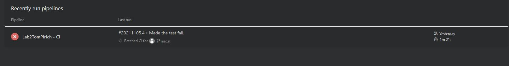
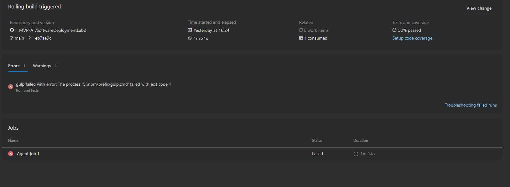
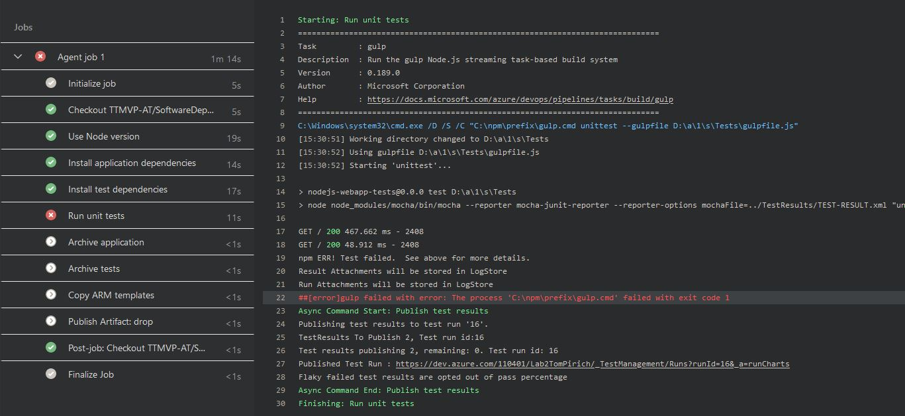
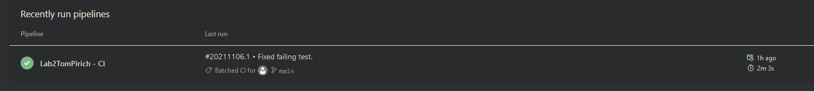
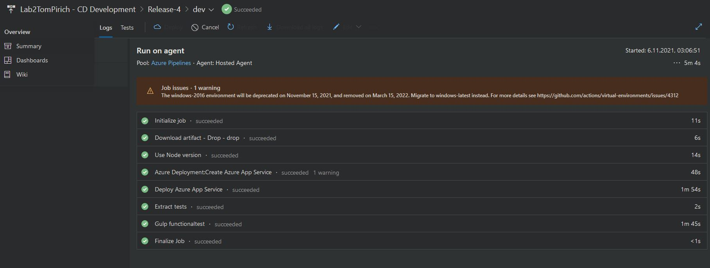
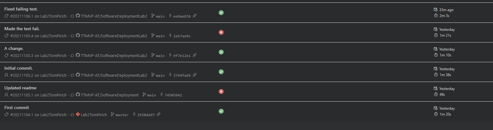
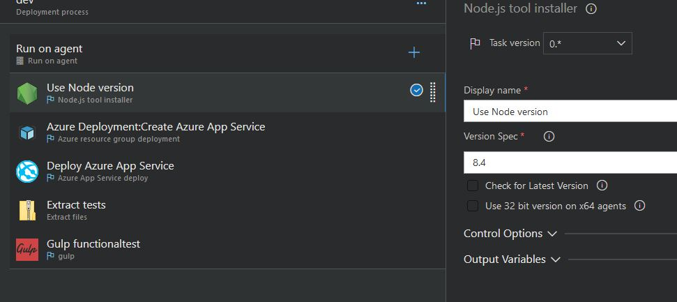
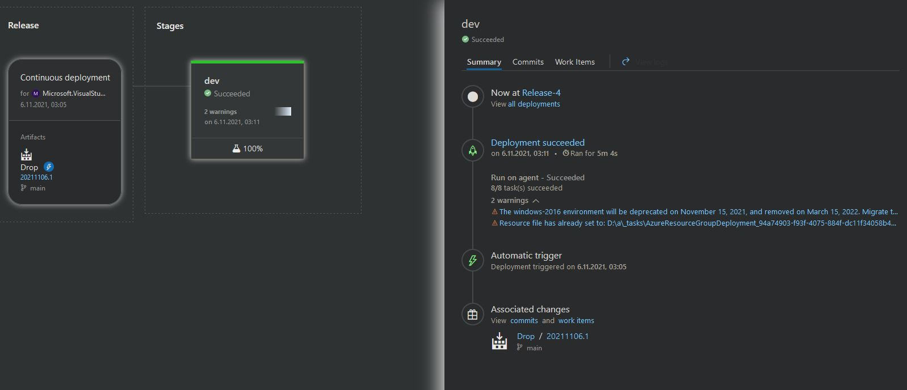
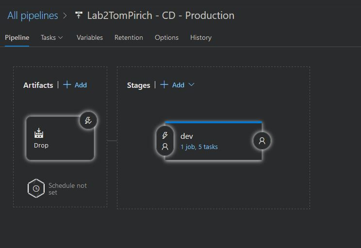

# SoftwareDeploymentLab2

## Links zu den Azure Web Apps (dev & production)
 
Development: https://lab2tompirichproduction.azurewebsites.net

Production: https://lab2tompirichproduction.azurewebsites.net

## Production: Screenshot der Azure DevOps build/Test/Deploy Pipeline incl.  erfolgreicher und nicht erfolgreicher Deployments

### Failed deploy (test failed)

#### Failed test

#### Details of the job with failed test

### Successful Deployment

### Job details

## All pipeline runs

## Screenshot der Azure DevOps Release Pipeline

### Tasks of the release pipelines

### Release (Development)

### Release (Production)

## Dokumentation wie die Releases freigegeben werden

### Production

Bei dem Production Server werden die Releases manuell freigegeben.
Hierzu wurde folgendes an der "Prod Releases" eigestellt:

* Bei den Stages der Pipeline auf die Pre-deployment conditions gehen
* Dann auf `manuell only` wechseln

### Development

Hier wird nach einen erfolgreichen deploy automatisch ein Release erstellt.
